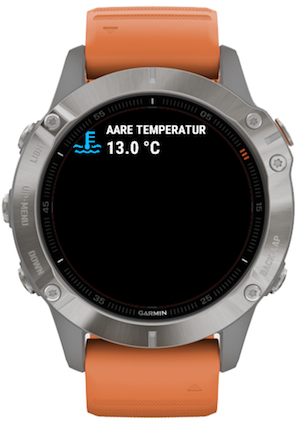
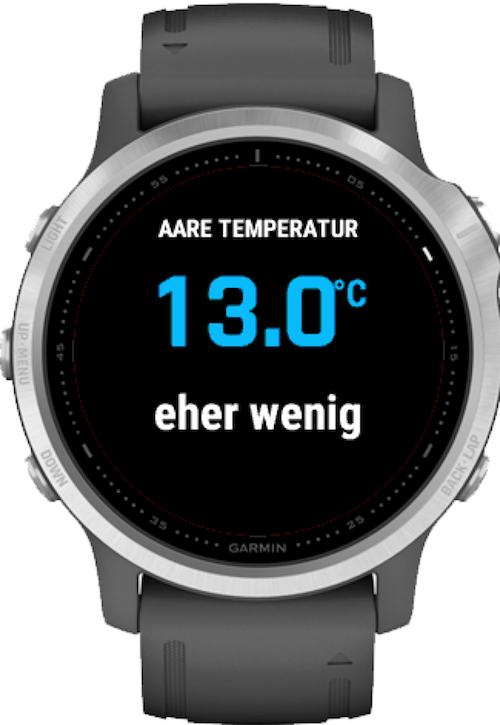

# Readme Aaretemperatur Widget

This is a __Garmin ICQ Widget__ target for the Garmin Fenix 5 an 6 Sport Smart Watch.
This widget will show the temperature of the river Aare in Bern in Switzerland. Swimming in the river Aare is great fun and many locals and tourist like it. 

IMPORTANT: Keep in mind that swimming in the Aare can be dangerous. 

## Overview
The widget shows the temperatur and flow level of the river _Aare_ in Bern.
The widget will make a WebRequest to the API and uses Mobilephone as proxy. It depends on the datasource of the API service. See below.

__Requirements:__

1. A compatible Garmin device as listed in chapter target device below.
2. A a connection to mobile phone with running Garmin ICQ app.

### Functionality

__Glance View__
- Shows temperatur in°C
- Mark if measurement is n/a or older than a day

__View__
- Shows temperatur in°C
- Color coding of temperature
- Flow as text categories
- timestamp
- Mark if latest measurement is older than two hours

### Target Device
- Garmin Fenix 5, 5S, 5 Pro 
- Garmin Fenix 6, 6Pro, 6S, 6X

## Data sources
- [Aare Guru](https://aare.guru/) (API see description [here](https://aareguru.existenz.ch/).
The API service is provided by [Bureau für digitale Existenz](https://bureau.existenz.ch/)
- The base data is measured and provided by _Bundesamt für Umwelt, Verkehr Energie und Kommunikatione der Schweizerischen Eidgenossenschaft_, [Hydrologie](https://www.hydrodaten.admin.ch/de/index.html?lang=de)

## Screenshots

__Aare Widged GlanceView__

__Aare Data View__

|

## Development

How to get startet with __Garmin Connect IQ__:
1. Install SDK 
2. Configure your development environment.

- Developer [information](https://developer.garmin.com/connect-iq/programmers-guide/)
- API documentation [SDK](https://developer.garmin.com/connect-iq/api-docs/)
